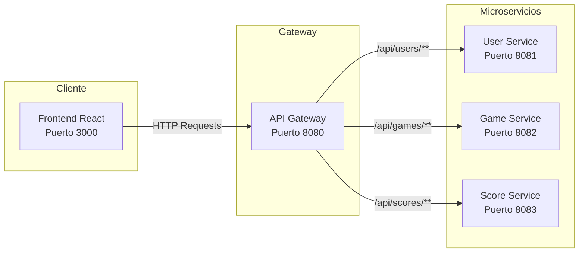
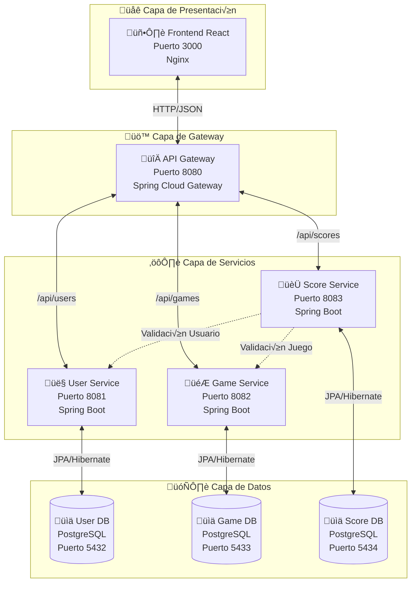
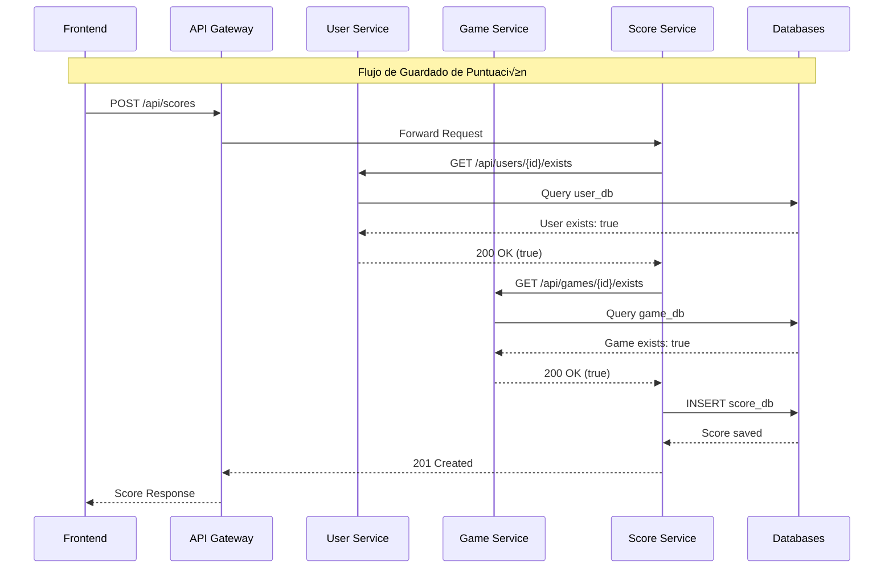
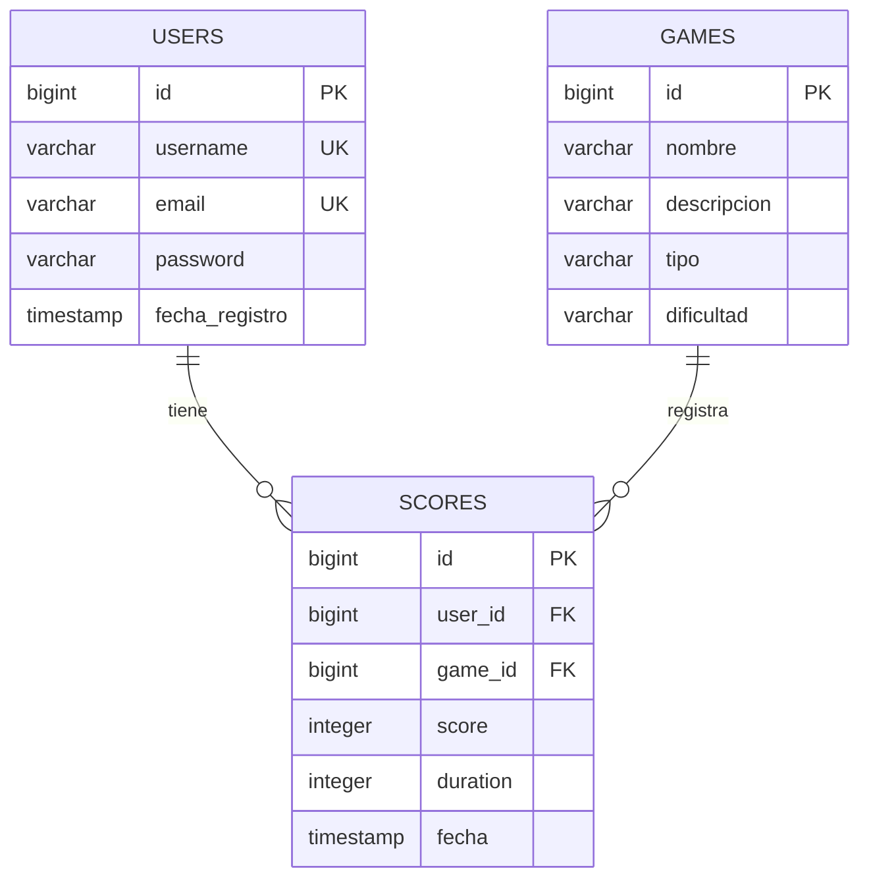
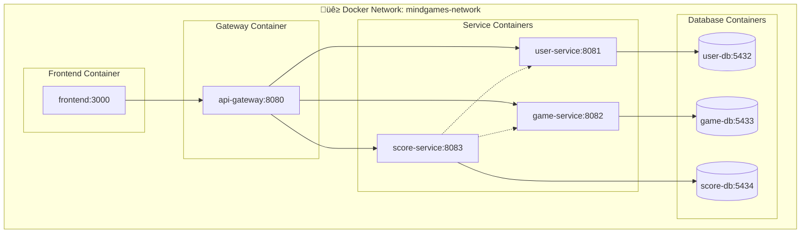

# 🧠 Mind Games - Documento de Entrega

## Proyecto de Aplicación Web con Arquitectura de Microservicios

**Fecha:** Diciembre 2025  
**Tecnologías:** Spring Boot, React, PostgreSQL, Docker

---

## 1. Descripción del Problema

### Contexto

En la actualidad, el entrenamiento cognitivo y la estimulación mental se han convertido en aspectos fundamentales para mantener una mente activa y saludable. Sin embargo, muchas personas no tienen acceso a herramientas interactivas que les permitan ejercitar sus capacidades mentales de manera entretenida y sistemática.

### Usuario Final

La aplicación está dirigida a:

- **Estudiantes** que desean mejorar sus habilidades matemáticas y de razonamiento lógico
- **Profesionales** que buscan ejercitar su memoria y agilidad mental durante pausas activas
- **Adultos mayores** que requieren estimulación cognitiva para mantener sus facultades mentales
- **Cualquier persona** interesada en desafiar y mejorar sus capacidades cerebrales

### Necesidad que Resuelve

Mind Games resuelve la necesidad de contar con una plataforma accesible, gratuita y divertida que permita:

- Ejercitar diferentes áreas cognitivas (memoria, lógica, matemáticas, observación)
- Llevar un registro personal del progreso y rendimiento
- Competir de manera sana mediante rankings globales
- Acceder desde cualquier dispositivo con conexión a internet

---

## 2. Objetivo General de la Aplicación

> **Desarrollar una aplicación web basada en arquitectura de microservicios que permita a los usuarios ejercitar sus capacidades cognitivas a través de juegos mentales interactivos, con persistencia de datos, sistema de puntuaciones y despliegue automatizado mediante Docker.**

---

## 3. Objetivos Específicos

### 3.1 Diseño de Base de Datos
- Diseñar la estructura de base de datos relacional utilizando PostgreSQL para almacenar información de usuarios, juegos y puntuaciones de manera independiente por cada microservicio.

### 3.2 Implementación de API REST
- Implementar APIs RESTful en cada microservicio siguiendo las mejores prácticas de diseño, incluyendo endpoints para operaciones CRUD y consultas especializadas.

### 3.3 Integración de Microservicios
- Integrar los microservicios utilizando el patrón **API Gateway** para centralizar las peticiones y gestionar la comunicación entre servicios.

### 3.4 Desarrollo del Frontend
- Desarrollar una interfaz de usuario moderna y responsiva con React que proporcione una experiencia de juego fluida e intuitiva.

### 3.5 Contenerización y Orquestación
- Contenerizar todos los servicios con Docker y orquestarlos con Docker Compose para facilitar el despliegue y la escalabilidad.

### 3.6 Validación y Seguridad
- Implementar validaciones de datos y configuración CORS para garantizar la seguridad e integridad de la aplicación.

---

## 4. Justificación de la Aplicación

### ¿Por qué se eligió esta temática?

1. **Relevancia Social:** El entrenamiento cognitivo es cada vez más importante en una sociedad donde el deterioro mental y el estrés son problemas crecientes.

2. **Aplicación Práctica:** Los juegos mentales demuestran de manera clara el funcionamiento de una arquitectura de microservicios con múltiples entidades interrelacionadas (usuarios, juegos, puntuaciones).

3. **Escalabilidad Natural:** La tem√°tica permite agregar nuevos juegos f√°cilmente sin modificar la estructura base, demostrando una de las principales ventajas de los microservicios.

### ¿Qué problema real resuelve?

| Problema | Solución Mind Games |
|----------|---------------------|
| Falta de acceso a herramientas de entrenamiento mental | Plataforma web gratuita y accesible |
| Dificultad para medir el progreso cognitivo | Sistema de puntuaciones y rankings |
| Aburrimiento en ejercicios mentales tradicionales | Juegos interactivos y variados |
| Necesidad de motivación para ejercitar la mente | Gamificación con niveles de dificultad |

### ¿Quién lo usaría?

- **Instituciones educativas:** Para complementar el aprendizaje de matemáticas y lógica
- **Empresas:** En programas de bienestar laboral y pausas activas
- **Centros de adultos mayores:** Para programas de estimulación cognitiva
- **Usuarios individuales:** Cualquier persona que desee ejercitar su mente

---

## 5. Patrón de Microservicio Utilizado

### Patrón Principal: API Gateway

El proyecto implementa el patrón **API Gateway** como punto de entrada único para todas las peticiones del cliente.


```mermaid
flowchart LR
    subgraph Cliente
        A[Frontend React<br/>Puerto 3000]
    end
    
    subgraph Gateway
        B[API Gateway<br/>Puerto 8080]
    end
    
    subgraph Microservicios
        C[User Service<br/>Puerto 8081]
        D[Game Service<br/>Puerto 8082]
        E[Score Service<br/>Puerto 8083]
    end
    
    A -->|HTTP Requests| B
    B -->|/api/users/**| C
    B -->|/api/games/**| D
    B -->|/api/scores/**| E
```

### Características del API Gateway Implementado

| Característica | Implementación |
|----------------|----------------|
| **Enrutamiento** | Spring Cloud Gateway con predicados de ruta |
| **CORS** | Configuración global para permitir peticiones cross-origin |
| **Load Balancing** | Preparado para balanceo de carga con m√∫ltiples instancias |
| **Logging** | Registro de todas las peticiones para debugging |

### Patrones Secundarios

1. **Database per Service:** Cada microservicio tiene su propia base de datos PostgreSQL independiente.

2. **Synchronous Communication:** Comunicación síncrona vía REST entre servicios cuando es necesario (ej: Score Service valida usuarios con User Service).

3. **DTO Pattern:** Uso de Data Transfer Objects para desacoplar las entidades de la capa de presentación.

---

## 6. Arquitectura General

### Diagrama de Arquitectura Completa


```mermaid
flowchart TB
    subgraph "🌐 Capa de Presentación"
        FE[🖥️ Frontend React<br/>Puerto 3000<br/>Nginx]
    end
    
    subgraph "üö™ Capa de Gateway"
        GW[🔀 API Gateway<br/>Puerto 8080<br/>Spring Cloud Gateway]
    end
    
    subgraph "⚙️ Capa de Servicios"
        US[👤 User Service<br/>Puerto 8081<br/>Spring Boot]
        GS[🎮 Game Service<br/>Puerto 8082<br/>Spring Boot]
        SS[🏆 Score Service<br/>Puerto 8083<br/>Spring Boot]
    end
    
    subgraph "🗄️ Capa de Datos"
        UDB[(üìä User DB<br/>PostgreSQL<br/>Puerto 5432)]
        GDB[(üìä Game DB<br/>PostgreSQL<br/>Puerto 5433)]
        SDB[(üìä Score DB<br/>PostgreSQL<br/>Puerto 5434)]
    end
    
    FE <-->|HTTP/JSON| GW
    GW <-->|/api/users| US
    GW <-->|/api/games| GS
    GW <-->|/api/scores| SS
    
    US <-->|JPA/Hibernate| UDB
    GS <-->|JPA/Hibernate| GDB
    SS <-->|JPA/Hibernate| SDB
    
    SS -.->|Validación Usuario| US
    SS -.->|Validación Juego| GS
```

### Diagrama de Comunicación entre Servicios


```mermaid
sequenceDiagram
    participant F as Frontend
    participant G as API Gateway
    participant U as User Service
    participant GA as Game Service
    participant S as Score Service
    participant DB as Databases
    
    Note over F,DB: Flujo de Guardado de Puntuación
    
    F->>G: POST /api/scores
    G->>S: Forward Request
    S->>U: GET /api/users/{id}/exists
    U->>DB: Query user_db
    DB-->>U: User exists: true
    U-->>S: 200 OK (true)
    S->>GA: GET /api/games/{id}/exists
    GA->>DB: Query game_db
    DB-->>GA: Game exists: true
    GA-->>S: 200 OK (true)
    S->>DB: INSERT score_db
    DB-->>S: Score saved
    S-->>G: 201 Created
    G-->>F: Score Response
```

### Diagrama de Entidades


```mermaid
erDiagram
    USERS {
        bigint id PK
        varchar username UK
        varchar email UK
        varchar password
        timestamp fecha_registro
    }
    
    GAMES {
        bigint id PK
        varchar nombre
        varchar descripcion
        varchar tipo
        varchar dificultad
    }
    
    SCORES {
        bigint id PK
        bigint user_id FK
        bigint game_id FK
        integer score
        integer duration
        timestamp fecha
    }
    
    USERS ||--o{ SCORES : "tiene"
    GAMES ||--o{ SCORES : "registra"
```

### Estructura de Contenedores Docker


```mermaid
flowchart TB
    subgraph "üê≥ Docker Network: mindgames-network"
        subgraph "Frontend Container"
            FC[frontend:3000]
        end
        
        subgraph "Gateway Container"
            GC[api-gateway:8080]
        end
        
        subgraph "Service Containers"
            UC[user-service:8081]
            GAC[game-service:8082]
            SC[score-service:8083]
        end
        
        subgraph "Database Containers"
            UDC[(user-db:5432)]
            GDC[(game-db:5433)]
            SDC[(score-db:5434)]
        end
    end
    
    FC --> GC
    GC --> UC
    GC --> GAC
    GC --> SC
    UC --> UDC
    GAC --> GDC
    SC --> SDC
    SC -.-> UC
    SC -.-> GAC
```

### Descripción de Componentes

| Componente | Tecnología | Puerto | Descripción |
|------------|------------|--------|-------------|
| **Frontend** | React 18 + Nginx | 3000 | Interfaz de usuario con 4 juegos interactivos |
| **API Gateway** | Spring Cloud Gateway | 8080 | Punto de entrada √∫nico, enrutamiento y CORS |
| **User Service** | Spring Boot 3.2 | 8081 | Gestión de usuarios y autenticación |
| **Game Service** | Spring Boot 3.2 | 8082 | Cat√°logo de juegos disponibles |
| **Score Service** | Spring Boot 3.2 | 8083 | Registro y consulta de puntuaciones |
| **User DB** | PostgreSQL 15 | 5432 | Base de datos de usuarios |
| **Game DB** | PostgreSQL 15 | 5433 | Base de datos de juegos |
| **Score DB** | PostgreSQL 15 | 5434 | Base de datos de puntuaciones |

---

## 7. Conclusiones Finales del Proyecto

### 7.1 Dificultades Encontradas

| Dificultad | Descripción | Solución Aplicada |
|------------|-------------|-------------------|
| **Configuración CORS** | Headers duplicados causaban errores en el navegador | Centralizar configuración CORS únicamente en el API Gateway |
| **Comunicación entre servicios** | Validación de entidades en diferentes microservicios | Implementar endpoints `/exists` y uso de RestTemplate |
| **Persistencia de datos** | Configuración de múltiples bases de datos | Contenedores PostgreSQL independientes con puertos diferentes |
| **Gestión de dependencias** | Conflictos con Lombok en algunos entornos | Implementación manual de getters/setters |
| **Orquestación Docker** | Orden de inicio de servicios dependientes | Uso de `depends_on` en docker-compose.yml |


## Anexos

### Comandos √ötiles

```bash
# Levantar todos los servicios
docker-compose up -d

# Ver logs de un servicio específico
docker logs -f user-service

# Reconstruir un servicio específico
docker-compose up -d --build frontend

# Acceder a la base de datos
docker exec -it user-db psql -U userapp -d userdb

# Ver estado de los contenedores
docker ps
```

### Endpoints de la API

| Método | Endpoint | Descripción |
|--------|----------|-------------|
| POST | /api/users | Crear usuario |
| POST | /api/users/login | Iniciar sesión |
| GET | /api/users | Listar usuarios |
| GET | /api/users/{id} | Obtener usuario |
| GET | /api/games | Listar juegos |
| GET | /api/games/{id} | Obtener juego |
| POST | /api/scores | Guardar puntuación |
| GET | /api/scores | Listar puntuaciones |
| GET | /api/scores/user/{userId} | Puntuaciones por usuario |
| GET | /api/scores/ranking/{gameId} | Ranking por juego |

---

**Desarrollado con ❤️ usando Spring Boot, React y Docker**
